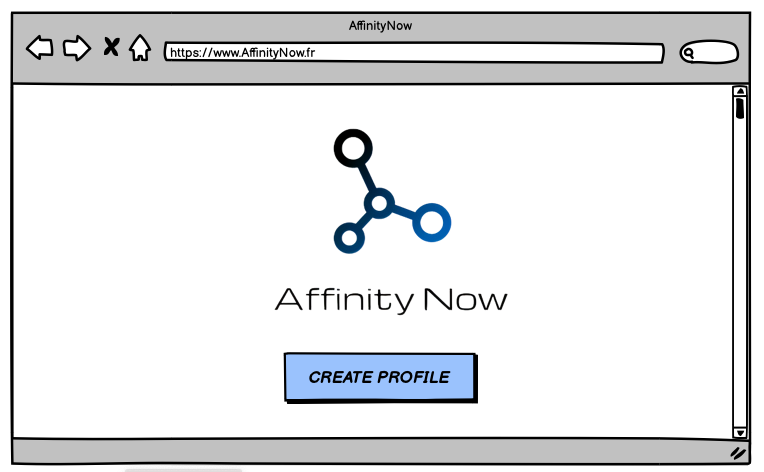
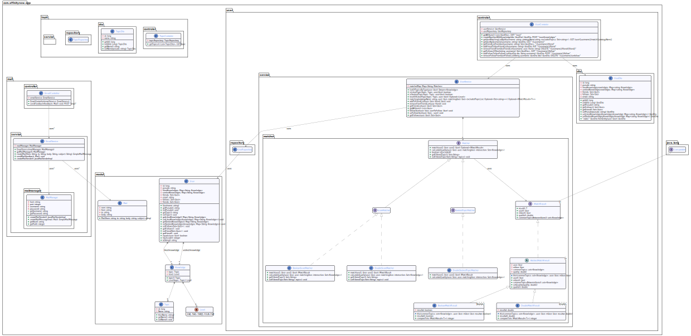

= AffinityNow DOC
Smart Mapper <SmartMapperProject@gmail.com>

== Utilisation et installation
=== Utilisation

Le projet AffinityNow une partie front _https://github.com/AffinityNow/AffinityNowFront_
et une partie back _https://github.com/AffinityNow/AffinityNow_.

Le back est écrit en Java et quand au front il s'agit d'une application angular donc
vous devrez avoir sur votre machine une version assez récente de Java (14 minimum), gradle (6) ainsi que Node (14).

=== Installation
* FRONT:
Il suffira d'execute simplement la commande : *ng serve* pour lancer le serveur.
Naviguez vers http://localhost:4200/. L'application se rechargera automatiquement si vous modifiez l'un des fichiers sources.

* BACK :
Il suffira d'executer simplement la commande : *gradle bootRun* pour lancer le serveur.
Une fois cela effectuer le serveur sera en marche et vous pourrz consulter la liste des End Points via _http://localhost:8080/swagger-ui.html_

== Les Fonctionalités d'Affinity Now

Aujourd'hui avec la version V1.2 de AffinityNow on peut :

1. Avoir la possibilité de renseigner les topics (centre d'intérêt)favoris

2. Pouvoir matcher avec une (ou plusieurs) personnes suivant une des méthodes de match suivantes :

    Match en fonction des centres d'intérêts aimés en commun qui ont une note supérieur à un seuil fixe.

    Match en fonction des centres d'intérêts aimés et recherchés en commun.

3. Il existe 2 types de match : avec ou sans resultat.
4. On peut déterminer la qualité d'un match entre 2 utilisateurs.

== Wireframes et Mockups "Affinity Now"
Main Page

SignIn

Matching

== Scénario d'utilisation
=== Cas Numéro 1 :

****
Vous avez envie de discuter sur vos sujets (topics) favoris avec des gens qui eux aussi
les partagent. Vous vous connectez sur l'application Affinity Now , ensuite vous renseignez vos topics
puis vous chercher des matchs. Enfin une liste s'affiche en vous montrant les personnes avec qui vous avez des
topics en communs.
****

=== Cas Numéro 2 :
****

****

== Services proposés

* Service  Utilisateur

==== SERVICE USER
****
POST / GET / PUT / DELETE
****
|===
|URL |METHODE |ACTION

|/utilisateur/knowledges|POST|Insertion d'un utilisateur ainsi que ses topics et les notations choisis
|/utilisateur/{name}/match/{nomdumatcher}|GET|Récupérer la liste des matchs d'un utilisateur donné.
|

|
|
|

|
|
|

|
|
|

|
|
|

|
|
|

|
|
|

|===

== Diagramme de classes

== Diagramme de Séquence

== Site Web Projet
_https://affinitynow.github.io/AffinityNow/_

== Retours & Feedback

== Burndown Chart 
